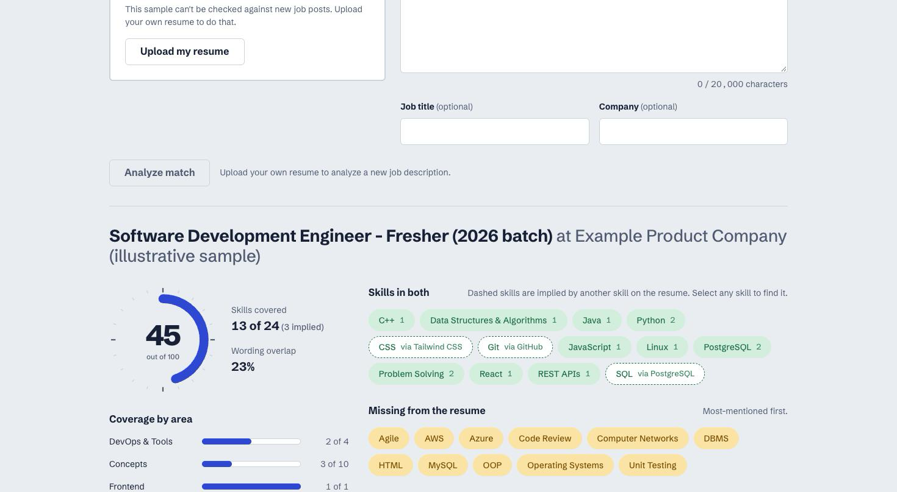

# JobFit

JobFit checks how well a resume matches a job description. Upload a resume PDF and paste a job post: JobFit extracts the text, finds the skills both documents mention using a 146-skill taxonomy with word-boundary matching, scores the overall fit with a hand-written TF-IDF similarity, and tells you which skills are missing and what to change. Every analysis is saved, so one resume can be compared against several job descriptions side by side.



**Live demo:** not deployed yet. Deployment to Render and Vercel is the next step; the link will be added here.

**Stack:** Python, Django 5, Django REST Framework, PostgreSQL, pdfplumber, Backblaze B2 (S3 API via boto3), React 18, Vite. Hosted on Render, Neon and Vercel.

---

## Contents

- [Features](#features)
- [Architecture](#architecture)
- [How the analysis works](#how-the-analysis-works)
- [Project structure](#project-structure)
- [Local setup](#local-setup)
- [Running tests](#running-tests)
- [Environment variables](#environment-variables)
- [API reference](#api-reference)
- [Privacy and security](#privacy-and-security)
- [Deployment](#deployment)
- [Known limitations](#known-limitations)
- [Design decisions](#design-decisions)

---

## Features

**Analysis**
- Overall match score from 0 to 100, clamped to 5-97 (a 100 isn't credible and a 0 is almost always a bug).
- Skills found in both documents, and skills the job description asks for that the resume lacks, most-mentioned first.
- Coverage by area: languages, frontend, backend, databases, DevOps & tools, concepts.
- 3-5 concrete suggestions, such as *"The JD mentions Docker 4 times but it doesn't appear in your resume."*
- PDF text extraction with pdfplumber, a pypdf fallback, and a clear error for scanned PDFs that need OCR.

**Website**
- Drag-and-drop upload with client-side type and size checks and a real upload progress bar.
- Animated SVG score gauge (requestAnimationFrame with ease-out; respects `prefers-reduced-motion`).
- Click a matched skill to highlight every occurrence in the resume text.
- History page: sortable by score and date, optimistic delete with rollback on failure.
- Compare page: skills as rows, job descriptions as columns, with a sticky first column that scrolls sideways on phones.
- "Try the demo" loads precomputed sample results with nothing uploaded.
- Loading skeletons, error states with retry, and a "waking up the server" notice for free-tier cold starts.
- Usable from 320px wide.

## Architecture

```
React (Vercel)
      │  upload PDF + JD text
      ▼
Django + DRF (Render)
      ├──> Backblaze B2    (store the PDF, S3-compatible)
      ├──> analysis engine (pure Python, no ML libs)
      └──> PostgreSQL      (Neon: resumes, job descriptions, analyses)
```

A request to analyze a job description goes through these layers:

```
frontend/src/hooks/useAnalysis.js    the only place the Analyze page calls the API
  └─ frontend/src/api/client.js      URLs, error format, XHR upload with progress
       └─ analysis/views.py          validation, throttling, demo read-only check
            └─ analysis/service.py   orchestration: extract, store, score, save
                 ├─ analysis/extractor.py   PDF -> text
                 ├─ storage/object_storage.py   S3-compatible storage or local media/
                 └─ analysis/scorer.py      the score
                      ├─ analysis/matcher.py     word-boundary skill matching
                      └─ analysis/similarity.py  TF-IDF + cosine
```

The analysis engine (`matcher`, `similarity`, `scorer`) is plain Python with no Django imports, so it can be tested and reasoned about without a database.

## How the analysis works

### 1. Skill matching (`analysis/matcher.py`, `analysis/skills.py`)

The taxonomy has 146 skills in six categories, each with a canonical name and aliases (`"PostgreSQL": ["postgres", "postgresql", "psql"]`). Each skill compiles to one case-insensitive regex with explicit boundaries:

```
(?<![a-z0-9.&])(?:alias1|alias2|...)(?![a-z0-9+#&])
```

This stops the classic substring bugs: "R" inside "React", "Go" inside "Google", "Java" inside "JavaScript", "SQL" inside "PostgreSQL", and "C" inside "C++". Plain `\b` isn't enough, because `+`, `#` and `.` aren't word characters. Ordinary English words are deliberately not aliases ("rest", "express", "node", "spring", "next").

The matcher returns the character positions of every match, which the frontend uses to highlight skills in the resume text.

### 2. Text similarity (`analysis/similarity.py`)

Hand-written TF-IDF and cosine similarity, using only `math` and `collections.Counter`:

```
tf(t,d)     = count(t,d) / len(d)
idf(t)      = log(N / (1 + df(t))) + 1
tfidf(t,d)  = tf(t,d) * idf(t)
cosine(a,b) = dot(a,b) / (||a|| * ||b||)
```

### 3. Scoring (`analysis/scorer.py`)

```
overall = round(100 * (
    0.45 * skill_coverage       # fraction of JD skills present in the resume
  + 0.35 * cosine_similarity    # TF-IDF similarity of the full texts
  + 0.20 * category_balance     # mean coverage across the JD's skill categories
))  then clamped to 5-97
```

The weights are a judgement call, explained in a comment in `scorer.py`. Category balance averages the per-category coverage, so matching one of six requested concepts scores 0.17 rather than counting the category as fully covered.

## Project structure

```
JobFit/
├── jobfit_api/                 Django project: settings, URLs, error handler, health check
├── resumes/                    Resume model, upload + detail/delete endpoints
├── analysis/
│   ├── skills.py               skills taxonomy
│   ├── matcher.py              word-boundary skill extraction
│   ├── similarity.py           TF-IDF + cosine
│   ├── scorer.py               score, gaps, suggestions
│   ├── extractor.py            PDF -> text (pdfplumber, pypdf fallback)
│   ├── service.py              orchestration shared by the API and commands
│   ├── demo.py                 fixed id of the read-only demo resume
│   ├── models.py               JobDescription, Analysis
│   ├── views.py, serializers.py, urls.py
│   ├── management/commands/    demo_analyze, seed_demo
│   └── tests/
├── storage/object_storage.py   S3-compatible storage (Backblaze B2) via boto3, local fallback
├── samples/
│   ├── jd_sde_fullstack.txt    sample JD for demo_analyze
│   └── seed/                   demo resume text + four sample JDs for seed_demo
├── frontend/
│   └── src/
│       ├── api/                API client, cold-start notice
│       ├── hooks/              useAnalysis, useHistory, useCompare
│       ├── components/         UploadZone, ScoreGauge, SkillChips, ResumeText, ...
│       ├── pages/              Analyze, History, Compare
│       ├── lib/                limits, formatting, remembered resumes
│       └── styles/
├── .github/workflows/ci.yml    pytest + frontend lint/build on every push
├── render.yaml                 Render web service definition (API)
├── frontend/vercel.json        SPA routing for Vercel
├── DECISIONS.md                design decisions, explained
└── requirements.txt
```

## Local setup

**Requirements:** Python 3.12+, Node.js 22+, PostgreSQL 15+.

Run these in order from the repository root.

```bash
# 1. Get the code
git clone https://github.com/mainak569/JobFit.git
cd JobFit

# 2. Backend dependencies
python3 -m venv .venv
source .venv/bin/activate
pip install -r requirements.txt

# 3. Database and local settings
createdb jobfit
cp .env.example .env
# Edit .env and set at least:
#   DJANGO_DEBUG=True
#   DATABASE_URL=postgres://localhost:5432/jobfit

# 4. Tables and demo data
python manage.py migrate
python manage.py seed_demo

# 5. Start the API on http://localhost:8000
python manage.py runserver
```

In a second terminal:

```bash
# 6. Frontend on http://localhost:5173
cd frontend
npm ci
npm run dev
```

Without storage credentials, uploaded PDFs are saved to `./media/` and the API logs a warning. Nothing else is needed to run locally.

### Management commands

| Command | What it does |
|---|---|
| `python manage.py demo_analyze <resume.pdf> <jd.txt> [--title ...] [--company ...]` | Extracts, stores and analyses a resume from the terminal, and prints the full analysis. |
| `python manage.py seed_demo` | Loads the demo resume and four sample job descriptions with precomputed analyses. Safe to run repeatedly. |

Example:

```bash
python manage.py demo_analyze path/to/resume.pdf samples/jd_sde_fullstack.txt --title "SDE I" --company "Example"
```

## Running tests

```bash
# Backend: matcher, TF-IDF, scorer, extractor, storage, API, commands
pytest

# Frontend
cd frontend
npm run lint
npm run build
```

The backend suite covers the word-boundary cases (R/React, Go/Google, Java/JavaScript, SQL/PostgreSQL, C/C++), TF-IDF against hand-calculated values, score clamping at both ends, the scanned-PDF error, storage fallback, every endpoint, rate limiting and CORS. GitHub Actions runs the same checks on every push.

## Environment variables

`.env.example` in the root and in `frontend/` lists every key with no values.

### Backend

| Variable | Default | Description |
|---|---|---|
| `DJANGO_SECRET_KEY` | none | Required when `DJANGO_DEBUG` is False. Generate a new one; never reuse the dev one. |
| `DJANGO_DEBUG` | `False` | `True` for local development only. |
| `DJANGO_ALLOWED_HOSTS` | `localhost,127.0.0.1` | Comma-separated hostnames, e.g. `your-api.onrender.com`. |
| `DATABASE_URL` | `postgres://localhost:5432/jobfit` | PostgreSQL connection URL. |
| `DJANGO_SECURE_SSL` | on when `DJANGO_DEBUG` is False | Forces HTTPS and secure cookies. Only CI turns it off. |
| `CORS_ALLOWED_ORIGINS` | `http://localhost:5173` | Comma-separated origins allowed to call the API. Never `*`. |
| `CSRF_TRUSTED_ORIGINS` | none | Comma-separated trusted origins, e.g. the Vercel URL. |
| `NUM_PROXIES` | unset | Set to `1` behind Render's proxy, so rate limiting uses the real client IP. |
| `STORAGE_ENDPOINT` | none | S3 endpoint, e.g. `https://s3.us-west-004.backblazeb2.com`. |
| `STORAGE_REGION` | none | Region matching the endpoint, e.g. `us-west-004`. |
| `STORAGE_BUCKET` | none | Private bucket name, e.g. `jobfit-resumes`. |
| `STORAGE_ACCESS_KEY_ID` | none | Application key id (B2 "keyID"). |
| `STORAGE_SECRET_ACCESS_KEY` | none | Application key secret (B2 "applicationKey"). |

If any `STORAGE_*` variable is missing, files are stored in `./media/` with a warning instead of crashing. On Render, `RENDER_EXTERNAL_HOSTNAME` is added to the allowed hosts automatically.

### Frontend

| Variable | Default | Description |
|---|---|---|
| `VITE_API_BASE_URL` | `http://localhost:8000/api` | Base URL of the API, e.g. `https://your-api.onrender.com/api`. |

## API reference

All endpoints are under `/api/`.

| Method | Path | Purpose |
|---|---|---|
| `POST` | `/api/resumes/` | Multipart PDF upload (field `file`). Extracts text, stores the file, returns id and a text preview. |
| `GET` | `/api/resumes/<id>/` | One resume, including its full extracted text. |
| `DELETE` | `/api/resumes/<id>/` | Deletes the resume, its analyses, and the stored file. |
| `POST` | `/api/analyze/` | `{resume_id, jd_text, title?, company?}` → the full saved analysis. Rate limited to 20/hour. |
| `GET` | `/api/analyses/?resume_id=` | History for one resume, newest first, 20 per page. |
| `GET` | `/api/analyses/<id>/` | One analysis in full. |
| `DELETE` | `/api/analyses/<id>/` | Deletes one analysis. |
| `GET` | `/api/compare/?resume_id=` | One resume against all its job descriptions, shaped as a table. |
| `GET` | `/api/health/` | `{"status": "ok"}` for uptime pings. |

**Upload rules:** PDF only, checked by the file's first bytes (`%PDF-`) rather than its extension; 5 MB maximum.

**Job description rules:** 50-20,000 characters.

**Analysis shape** (abridged):

```json
{
  "id": "8a384fdd-...",
  "resume_id": "1d481871-...",
  "job_description": { "id": "...", "title": "Frontend Engineer", "company": "Example", "raw_text": "...", "created_at": "..." },
  "overall_score": 61,
  "similarity_score": 0.3182,
  "matched_skills": [{ "name": "React", "category": "frontend", "jd_count": 2, "resume_count": 1, "resume_spans": [[27, 32]] }],
  "missing_skills": [{ "name": "Next.js", "category": "frontend", "jd_count": 1 }],
  "category_scores": { "frontend": { "label": "Frontend", "matched": 3, "required": 5, "coverage": 0.6 } },
  "suggestions": ["The JD mentions Next.js once and it doesn't appear in your resume — add it only if you've genuinely used it."],
  "created_at": "2026-09-15T00:00:00Z"
}
```

**Compare shape:** `columns` has one entry per analysis; `rows` has one entry per skill; `rows[i].cells[j]` is `"present"`, `"absent"`, or `null` when job description *j* didn't ask for skill *i*.

**Errors** always have the same shape:

```json
{ "error": { "code": "validation_error", "message": "file: The file is not a PDF.", "fields": { "file": ["The file is not a PDF."] } } }
```

| Code | Status | When |
|---|---|---|
| `validation_error` | 400 | Invalid input (`fields` has per-field messages). |
| `demo_read_only` | 403 | Trying to change the shared demo resume. |
| `not_found` | 404 | Unknown id or endpoint. |
| `method_not_allowed` | 405 | Wrong HTTP method. |
| `scanned_pdf` | 422 | The PDF has no selectable text and needs OCR. |
| `unreadable_pdf` | 422 | The file can't be parsed as a PDF. |
| `throttled` | 429 | More than 20 analyses in an hour. |
| `server_error` | 500 | Unexpected failure (details go to logs, never to the client). |

## Privacy and security

- **No public list of resumes.** There are no accounts, so a list endpoint would show everyone's uploads to everyone. A resume is only reachable by its random UUID, which the uploading browser remembers in `localStorage`.
- **Files are private.** The bucket is private and the database stores the object key, never a URL. Links are presigned on demand and expire after 15 minutes.
- **The demo is read-only.** Every visitor shares the demo resume, so its analyses can't be deleted and new job descriptions can't be analysed against it.
- **Uploads are checked by content**, not by extension or Content-Type, and capped at 5 MB.
- **Rate limiting** on `/api/analyze/`: 20 per hour per client IP.
- **CORS** is an explicit allow-list read from the environment.
- The demo resume text has phone numbers and email addresses removed.

## Deployment

Everything runs on free plans that don't need a payment card.

| Part | Service | Config |
|---|---|---|
| API | Render web service, Singapore region | `render.yaml` |
| Database | Neon PostgreSQL | `DATABASE_URL` |
| Resume PDFs | Backblaze B2, private bucket (S3-compatible) | `STORAGE_*` |
| Frontend | Vercel | `frontend/vercel.json`, `VITE_API_BASE_URL` |

**Steps**

1. **Neon:** create a project and copy the pooled connection string (it includes `sslmode=require`). This is `DATABASE_URL`.
2. **Backblaze B2:** create a *private* bucket, then an application key restricted to that bucket. Note the keyID, the applicationKey, and the bucket's S3 endpoint (e.g. `s3.us-west-004.backblazeb2.com`, whose region is `us-west-004`).
3. **Render:** New → Blueprint → select this repository. Fill in the variables marked `sync: false`. Every build runs `collectstatic`, `migrate` and `seed_demo` (idempotent), because the free plan has no shell to run them afterwards.
4. **Vercel:** import the repository with root directory `frontend`, framework Vite, and set `VITE_API_BASE_URL` to `https://<your-service>.onrender.com/api`.
5. **Render again:** set `CORS_ALLOWED_ORIGINS` and `CSRF_TRUSTED_ORIGINS` to the Vercel URL and redeploy.

**Production settings:** `DEBUG` off, a generated `SECRET_KEY`, HTTPS redirect with Render's proxy header trusted, secure session and CSRF cookies, whitenoise for static files, gunicorn as the server, and logs to stdout.

**Free-tier reality:** the Render API sleeps after 15 minutes without traffic and takes roughly 50 seconds to wake. The site shows *"Waking up the server, this takes about a minute on the free tier"* when a request takes longer than 3 seconds, and pings the API as soon as the page opens so it is often awake by the time you've found your PDF.

## Known limitations

- **Keyword matching, not understanding.** A skill counts only if it is named. "Git" is missing if the resume only says "GitHub"; "Go" can match the English verb ("ready to go live").
- **Two-document TF-IDF is noisy.** With only a resume and a job description, IDF gives words that appear in both documents less weight than words in one, which keeps raw similarity low (typically 0.05-0.4) even for relevant pairs.
- **The score is a heuristic.** The 0.45 / 0.35 / 0.20 weights are chosen, not fitted to hiring outcomes.
- **English-centric taxonomy**, weighted toward Indian SDE and frontend roles; skills outside the 146 are invisible to the skill score.
- **Scanned PDFs aren't supported.** There is no OCR; the API explains this instead of returning empty text.
- **Access by id is not real authentication.** Anyone given a resume's id can read it.
- **Rate limits are per server process**, so they loosen if the API runs several workers.
- **Remembered resumes live in one browser.** Clearing site data or switching devices loses the list (the data stays on the server).
- **Cold starts** on the free tier, as described above.

## Design decisions

[`DECISIONS.md`](DECISIONS.md) explains the main choices in detail: hand-written TF-IDF, JSONFields over tables, storing object keys instead of URLs, word-boundary matching, React memoization, XHR uploads, and where the design breaks at scale. Non-obvious decisions in the code are marked with `WHY:` comments.
